# Medical Hangman

Medical Hangman is a word-guessing game created using Python that aims to exercise your knowledge of medical terms. 

The game is divided into four categories: Bone, Organ, Disease or Condition, and Radiology terms. It was developed with the purpose of combining medical knowledge with new technology skills. 

Whether you're a medical professional looking to test your vocabulary or someone interested in learning medical terminology in a playful manner, this game offers an enjoyable way to do so.

[Medical Hangman Live Page](https://medical-hangman-9035ef835c7a.herokuapp.com/)

## CONTENTS

- [Medical Hangman](#medical-hangman)
  - [CONTENTS](#contents)
  - [Project Goals](#project-goals)
  - [User Experience (UX)](#user-experience-ux)
    - [Target Audience](#target-audience)
    - [User Requeriments and Expectations](#user-requeriments-and-expectations)
    - [User Stories](#user-stories)
      - [First Time Visitor Goals](#first-time-visitor-goals)
      - [Returning Visitor Goals](#returning-visitor-goals)
      - [Frequent Visitor Goals](#frequent-visitor-goals)
    - [Flow Chart](#flow-chart)
  - [Design](#design)
    - [Color Scheme](#color-scheme)
    - [Imagery](#imagery)
  - [Google Sheets Integration](#google-sheets-integration)
  - [Features](#features)
    - [Existing Features](#existing-features)
      - [Favicon](#favicon)
      - [Game Menu](#game-menu)
      - [How to Play](#how-to-play)
      - [Highscores](#highscores)
      - [Player Name Input](#player-name-input)
      - [Category Selection](#category-selection)
      - [Gameplay](#gameplay)
      - [End of Game](#end-of-game)
      - [Score Calculation](#score-calculation)
      - [Highscore Submission](#highscore-submission)
      - [Game Over Handling](#game-over-handling)
    - [Future Implementations](#future-implementations)
  - [Technologies Used](#technologies-used)
    - [Languages Used](#languages-used)
    - [Frameworks, Libraries \& Programs Used](#frameworks-libraries--programs-used)
    - [Modules Imported](#modules-imported)
  - [Testing](#testing)
    - [Bugs](#bugs)
  - [Deployment](#deployment)
    - [Code Institute Python Essentials Template](#code-institute-python-essentials-template)
    - [Deployment process](#deployment-process)
    - [Local Development](#local-development)
      - [How to Fork](#how-to-fork)
      - [How to Clone](#how-to-clone)
  - [Credits](#credits)
    - [Code](#code)
    - [Content](#content)
    - [Media](#media)
  - [Acknowledgments](#acknowledgments)

---

## Project Goals

The Medical Hangman project was developed with the following goals in mind:

1. Learn Medical Terminology: Provide a gamified and engaging platform for users to practice and enhance their knowledge of medical terms across various categories such as bones, organs, diseases/conditions, and radiology.

2. Combine Medical Knowledge with Technology: Bridge the gap between medical expertise and technology skills by creating a project that leverages programming to create a fun and educational experience for medical professionals and enthusiasts.

3. Interactive Learning: Offer an interactive and enjoyable way to learn medical terminology by integrating the classic game of Hangman with medical terminology, encouraging players to recall terms, improve their memory, and reinforce their understanding.

4. User-Friendly Interface: Design an intuitive and user-friendly interface that caters to both medical professionals and individuals interested in learning medical terms, making it easy for players to choose categories, input guesses, and navigate through the game.

5. Highscore Tracking: Implement a highscores system that records and displays the top scores achieved by players, encouraging healthy competition and motivating players to improve their performance with each round.

6. Educational Entertainment: Create a project that not only entertains players but also educates them, providing a valuable resource for both medical students looking to strengthen their medical vocabulary and enthusiasts curious about medical terminology.

7. Showcase Technical Skills: Demonstrate programming skills by integrating various Python libraries, working with Google Sheets API for score tracking, and employing ASCII art for visual representation, resulting in a polished and functional application.

8. Customizable and Extensible: Design the project in a modular manner, allowing for easy addition of new categories, terms, and features, thus enabling future expansion and customization.

By achieving these project goals, Medical Hangman aims to provide a unique and enjoyable way for individuals to interact with medical terminology, enhance their vocabulary, and have fun while doing so.

[Back to Contents](#contents)

## User Experience (UX)

### Target Audience

Medical Hangman is designed to cater to the following target audience:

- Health Enthusiasts: Individuals with an interest in medical topics and health, can use the game as a tool to refresh and expand their medical vocabulary in a relaxed and enjoyable manner.

- Trivia and Puzzle Lovers: Fans of word-based games, trivia, and puzzles can enjoy a challenging and educational game that combines their passion for language with medical terminology.

- Casual Gamers: Those looking for casual entertainment can enjoy the game as a leisure activity while benefiting from exposure to medical terms.

- Technology Enthusiasts: Individuals interested in programming and technology can explore the codebase and see how different technologies like Google Sheets API and ASCII art can be integrated to create an interactive application.

### User Requeriments and Expectations

- User Requirements: The primary user requirements for Medical Hangman include a desire to improve medical terminology knowledge, engage in a fun and educational activity, and challenge oneself with word-based games. Users may also have varying levels of familiarity with medical terms, making the game suitable for both beginners and medical professionals seeking to enhance their vocabulary.

- User Expectations: Users can expect an intuitive and interactive game interface that allows them to select medical term categories, guess letters, and receive immediate feedback on their guesses. The game is designed to provide a balance between challenge and enjoyment, encouraging players to test their knowledge while having fun. Users can also anticipate a highscores feature that tracks their performance and motivates improvement with each playthrough. Additionally, users interested in programming can explore the codebase to understand the integration of various technologies.

### User Stories

#### First Time Visitor Goals

- As a first-time visitor, I want to understand how to play the game and learn about its purpose in relation to medical terminology.
- I want to explore the different categories available and choose one that interests me the most.
- I aim to experience an engaging and interactive interface that guides me through the gameplay process.

#### Returning Visitor Goals

- As a returning visitor, I want to challenge myself with new rounds of the game and improve my score in different medical term categories.
- I wish to continue enjoying the entertaining aspect of the game while reinforcing my medical vocabulary.
- I look forward to comparing my current highscore with my previous ones and with scores from other players.

#### Frequent Visitor Goals

- As a frequent visitor, I want to explore all the available categories and consistently achieve higher scores.
- I am excited to see my name on the highscores leaderboard and strive to maintain or improve my position.
- I aim to share my progress and achievements with friends and colleagues, promoting healthy competition among fellow players.

### Flow Chart

[Lucidchart](https://www.lucidchart.com/pages/) was used for designing the program's flow.

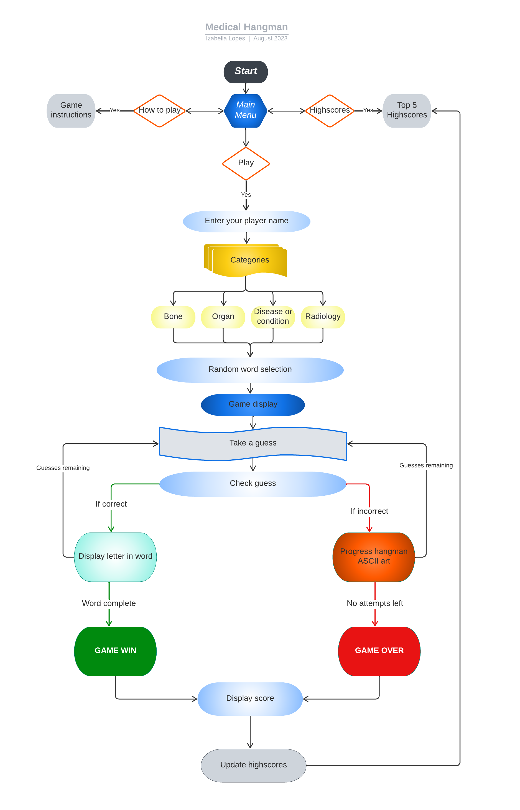

[Back to Contents](#contents)

---

## Design

### Color Scheme

Medical Hangman employs a carefully chosen color scheme to enhance the visual experience and improve readability. The color scheme is implemented using the colorama library, which allows for easy text coloring and formatting. Here are the key color elements used in the game:

- BOLD (Bright Text): Highlights essential content with increased brightness.

- BOLD_GREEN: Uses vibrant green for headings, menus, and important messages.

- GREEN: Represents correct guesses and positive outcomes.

- BOLD_BLUE: Applies blue to the "Take a guess" prompt and the player's score, capturing the player's focus.

- BOLD_MAGENTA: Utilizes bold magenta to denote missed letters, facilitating quick identification.

- RED: Signals errors, mistakes, or unsuccessful attempts.

- YELLOW: Separates sections with yellow lines for organization.

- CYAN: Differentiates categories with cyan text.

### Imagery

The visual appeal of Medical Hangman is accentuated by carefully crafted ASCII art imagery. 

- Titles: The titles are generated using the Stick Letters font from the ASCII art generator [patorjk.com](https://patorjk.com/software/taag/#p=display&f=Stick%20Letters&t=WELCOME%20TO%0AMEDICAL%20HANGMAN!), contributing a unique and captivating aesthetic. 

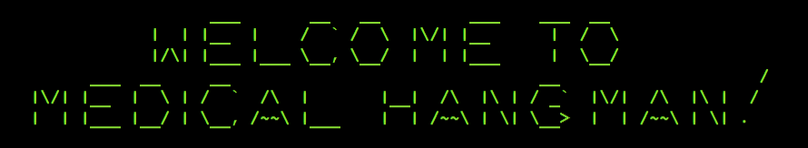

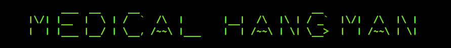

- Hangman stages: I've added a personal touch to the hangman stages by combining ASCII art generated with the [Electronic font](https://patorjk.com/software/taag/#p=display&h=1&v=1&f=Electronic&t=C) and the [ANSI Regular font](https://patorjk.com/software/taag/#p=display&h=1&v=1&f=ANSI%20Regular&t=e) from Patorjk's ASCII Art Generator. Each stage represents the increasing severity of the poor hangman's fate.

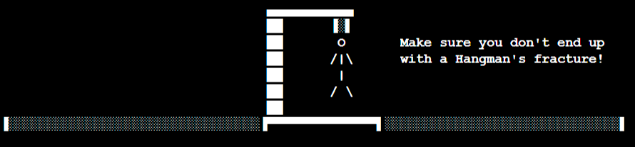

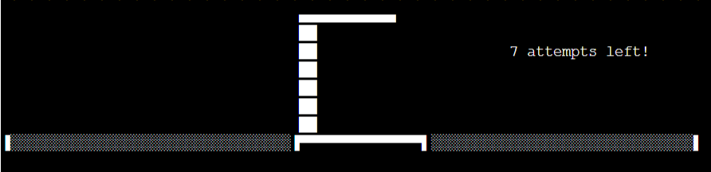

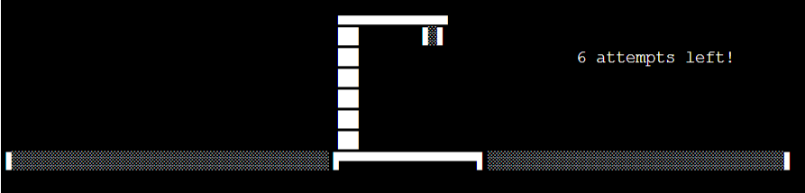

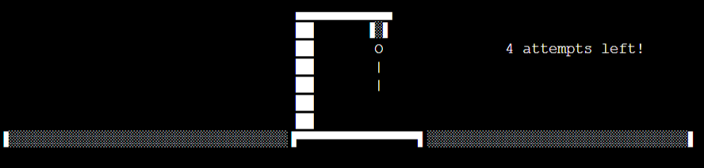

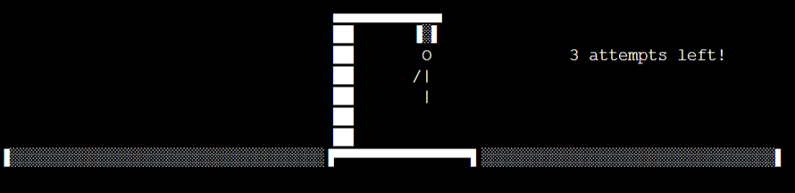

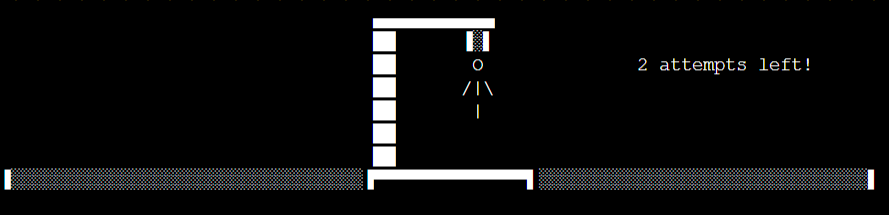

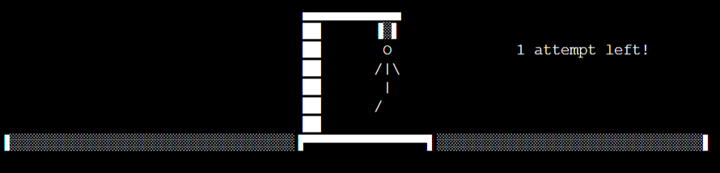

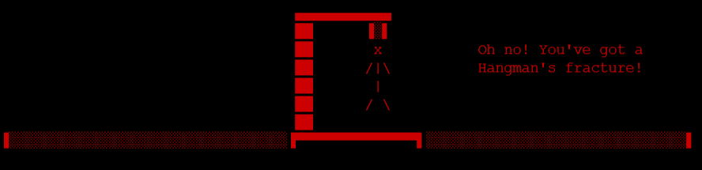

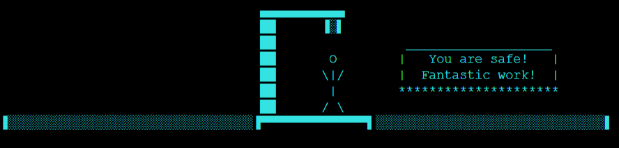

[Back to Contents](#contents)

---

## Google Sheets Integration

Utilize the ['medical_hangman'](https://docs.google.com/spreadsheets/d/1a13xeQ8T7SavpKMjG5aR-Er4OXXsyd4ns8axhWKPYYA/edit?usp=sharing) Google Sheet to seamlessly import data into the Medical Hangman game. The 'word_list' worksheet, organized into four columns representing different categories, serves as the source of words for the game. Additionally, the 'highscores' sheet is employed to store and display player highscore data, enhancing the competitive aspect of the game.

[Back to Contents](#contents)

---

## Features

### Existing Features

#### Favicon

The website features a favicon that is visible in the browser tab.

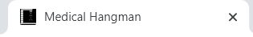

#### Game Menu

The main screen welcomes players to the 'Medical Hangman' game. It features a prominent title accompanied by a formatted line, creatively incorporating a cross to gently emphasize the game's connection with the medical domain. Complementing these elements is an intriguing ASCII art image.

The game starts with a menu with three options:

1. Play: Starts a new game.
2. How to Play: Displays instructions on how to play the game.
3. Highscores: Displays the top 5 highscores from previous games.

When a player selects an invalid choice from the game menu, the code displays an error message and prompts the player to choose again until a valid option is provided. This prevents unexpected behavior and maintains a smooth and user-friendly gaming experience.

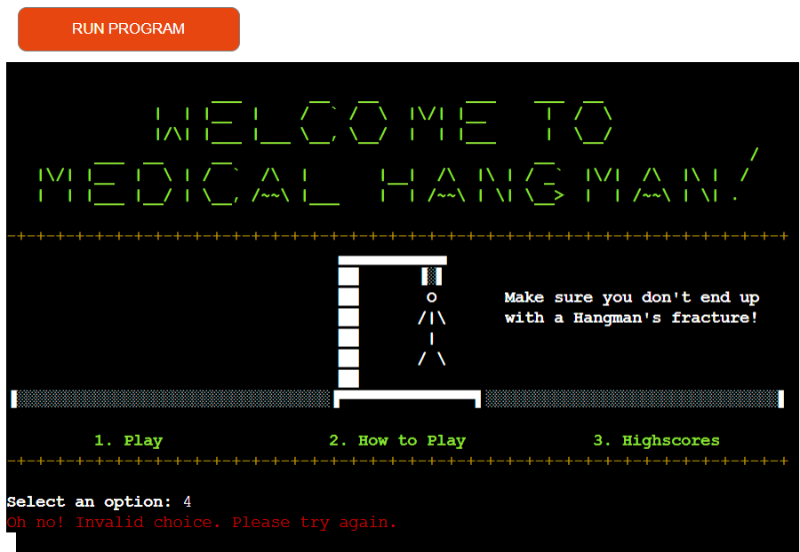

#### How to Play

The "How to Play" section provides instructions on how to play the game, including details about the goal, choosing a category, guessing letters, correct and incorrect guesses, and the game's end conditions.

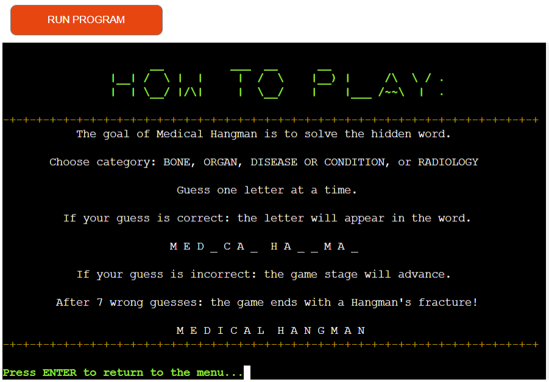

#### Highscores

The "Highscores" section displays the top 5 highscores achieved by players in previous games. It lists the player names and their scores. Data is retrieved from the 'highscores' Google Sheets and sorted in descending order.

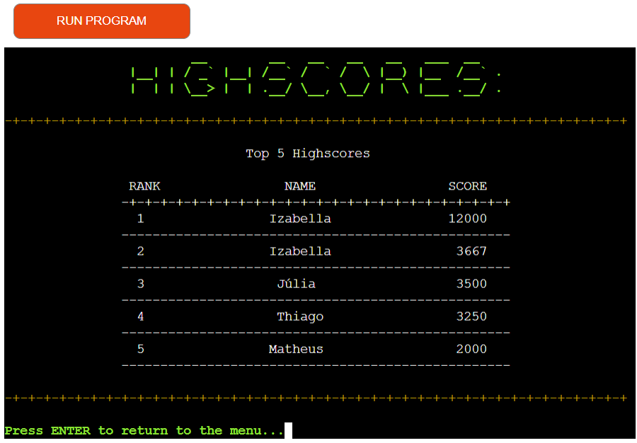

#### Player Name Input

The game allows players to enter their name before starting a new game. The input is carefully validated to ensure it consists solely of letters. If the input is correct, the game proceeds as intended, ensuring a smooth and error-free experience for the player.

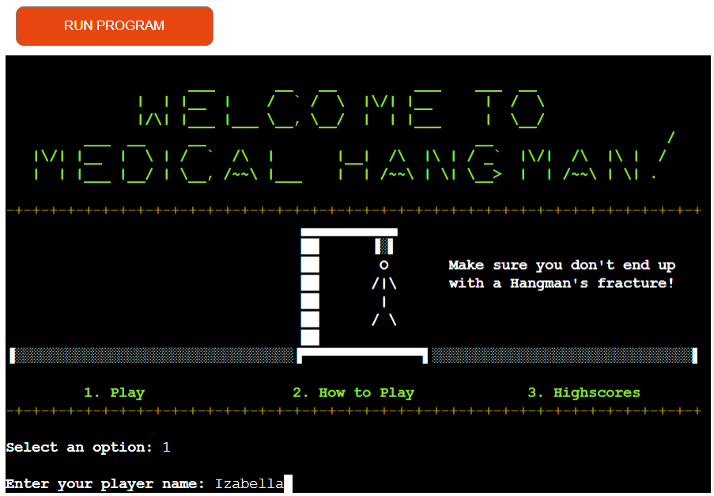

If the player's input doesn't meet this requirement, the code generates informative error messages. For instance:
- If the player enters an empty name, a message notifies them that a name must be provided.
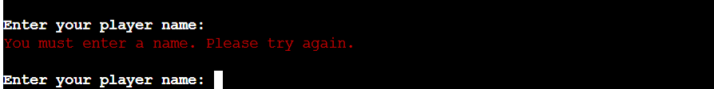

- If the name includes non-letter characters, a message instructs the player to use only letters for their name.

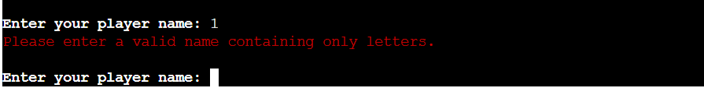

#### Category Selection

This page begins by warmly welcoming the player with their name. After a brief pause for feedback, the available medical word categories are presented. The player is then given the opportunity to select a category from the following options: Bone, Organ, Disease or Condition, and Radiology. The categories are visibly displayed, and the player can input the associated number to make their category selection and initiate the game.

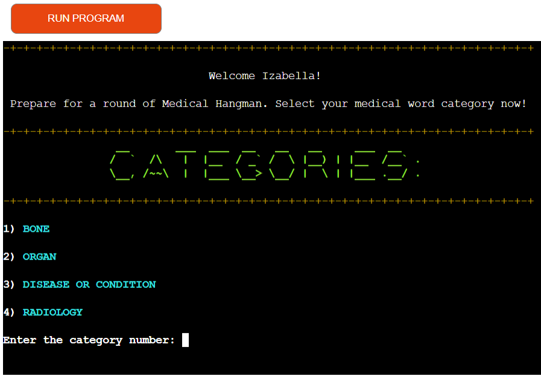

If an invalid category selection is made, the system displays an error message to inform the player about the issue. This helps guide the player towards making a valid choice from the available medical word categories.

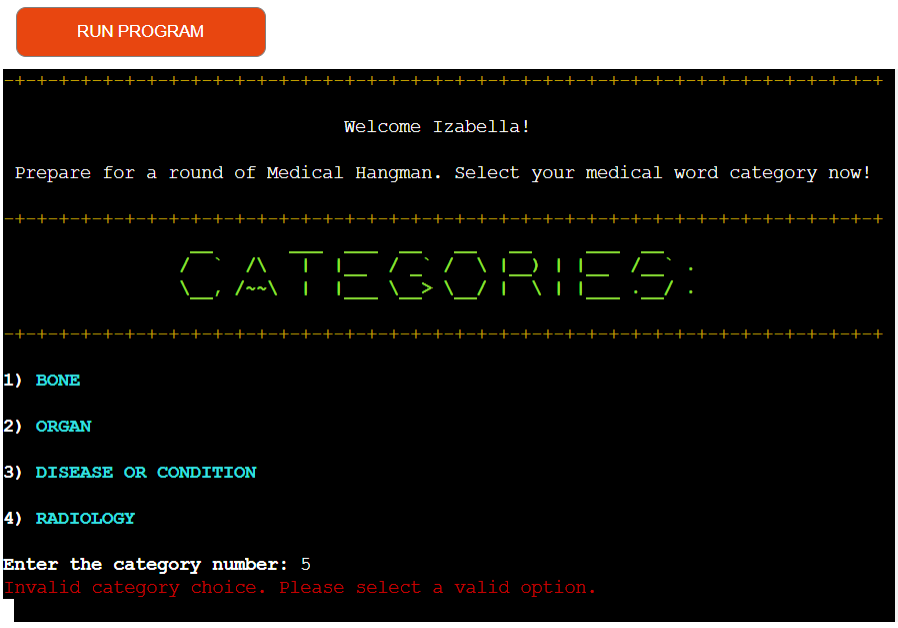

#### Gameplay

During gameplay, the player is presented with a hangman image representing the number of incorrect guesses. The hidden word, which is formatted with underscores and spaces, is displayed, along with missed letters. The game supports multiple rounds where players can choose from four medical categories: Bone, Organ, Disease or Condition, and Radiology. Players must guess letters to uncover the hidden medical term, one letter at a time. Correct guesses reveal letters in the word, while incorrect guesses result in the progression of a hangman figure. A limit of 7 incorrect guesses is set before the game ends. Players are given a score based on their performance, considering word length, remaining lives, and time taken.

- Well done:
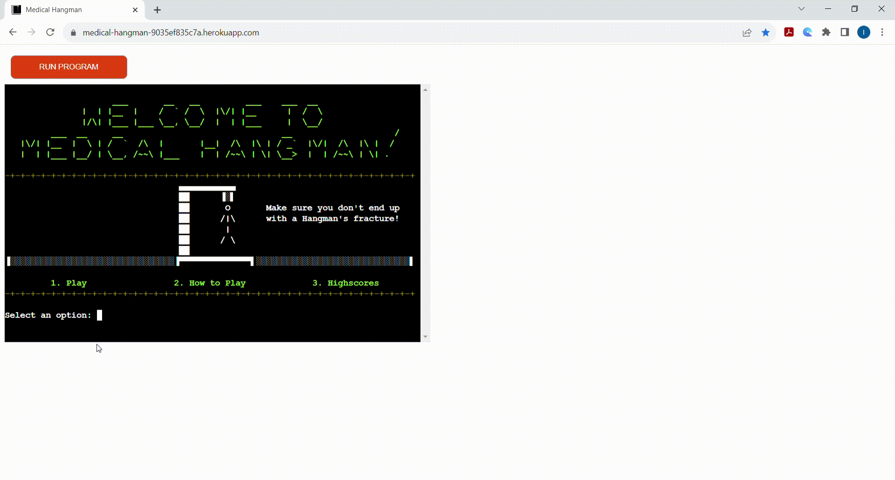

- Game over:
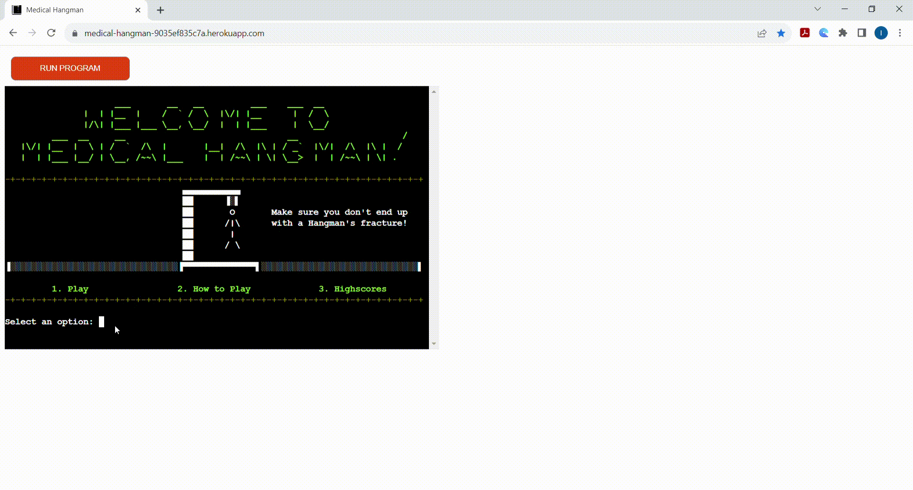

- You've already guessed that letter:
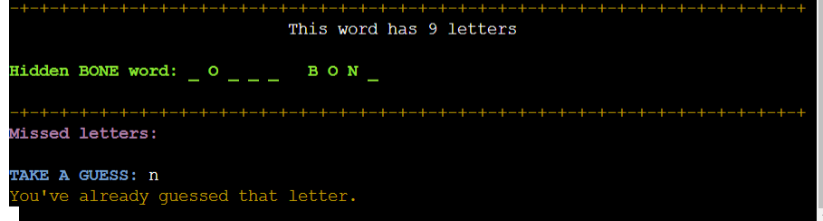

- Correct guess:
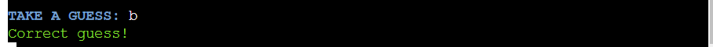

- Incorrect guess:
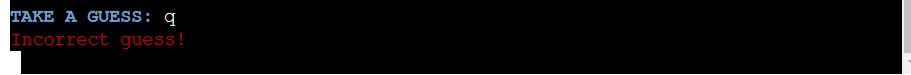

#### End of Game

When the game ends, either due to the player guessing the word correctly or running out of attempts, the game provides feedback on the outcome and displays the player's score.

Subsequently, a prompt emerges: "Would you like to play again?" Please enter 'y' for yes, 'n' for no, or 'h' to see the highscores.

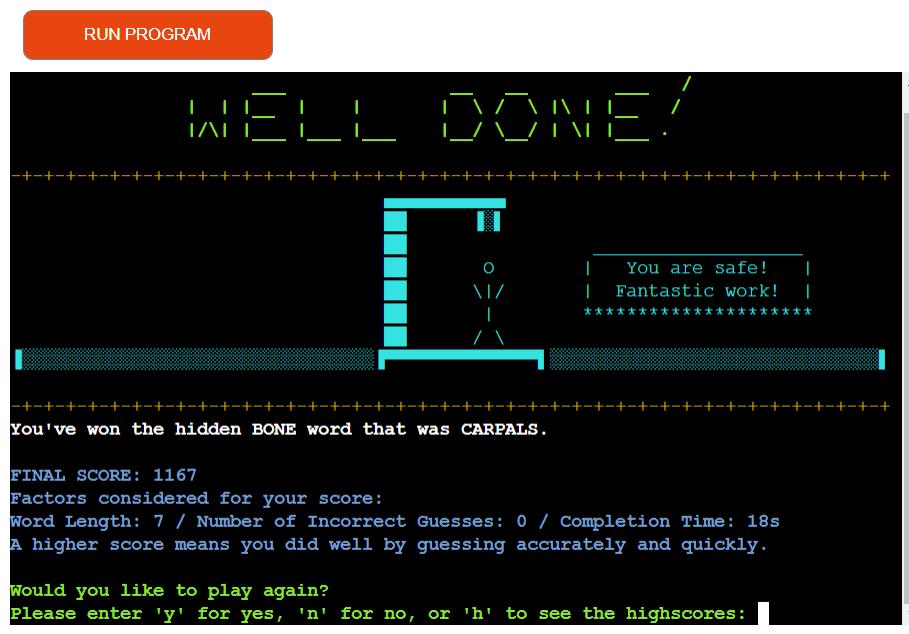

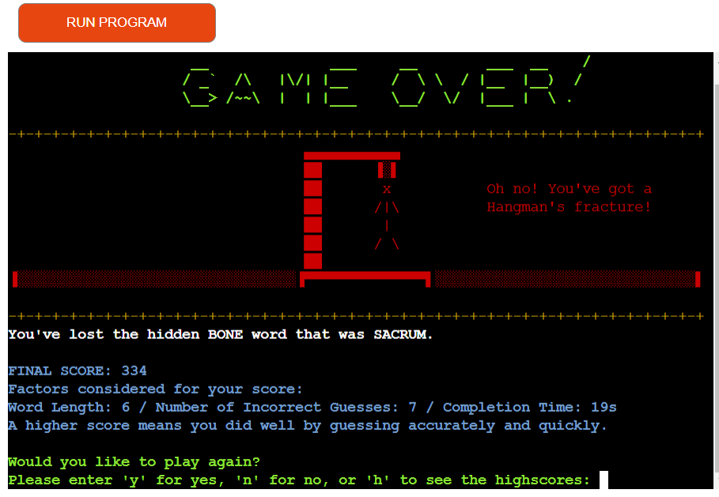

#### Score Calculation

In the Medical Hangman game, the player's score is determined based on various factors, including their performance and speed during the game. The scoring formula takes into account the length of the word, the number of incorrect guesses, and the time taken to complete the game. Here's how the score is calculated:

- Base Score Calculation:
  - The base score is calculated using the following formula:
  - Base Score = (Word Length * 500) + (Incorrect Guesses * 1000)
  - Word Length: The length of the word in the game's selected category (BONE, ORGAN, DISEASE OR CONDITION, or RADIOLOGY).
  - Incorrect Guesses: The number of incorrect letter guesses made during the game.

- Time Factor:
  - The time factor adjusts the base score based on the time taken to complete the game. The formula for calculating the time factor is as follows:
  - Time Factor = max(1, 10 - Time (seconds) // 10)
  - Time (seconds): The time taken to complete the game in seconds.

- Final Score:
  - The final score is calculated by dividing the base score by the time factor and rounding up:
  - Final Score = ceil(Base Score / Time Factor)
  - The calculated final score is an indicator of the player's performance in the game. A higher score reflects quicker and more accurate guesses, while a lower score might indicate longer playtime and a higher number of incorrect guesses.

- Saving Highscores:
  - After completing a game, the player's name and final score are recorded in the highscores table. The top 5 scores are displayed in the highscores section of the game.

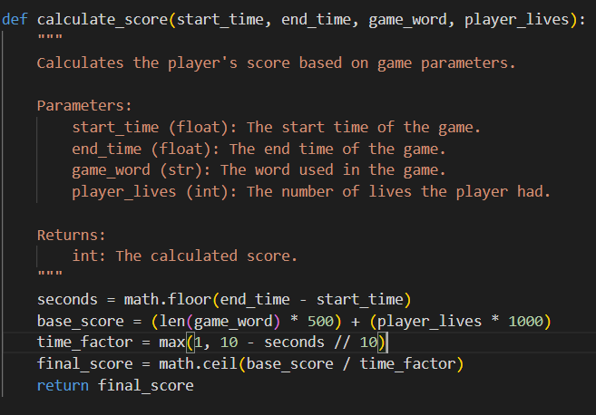

#### Highscore Submission

After the game ends, the player's score is saved to a [Google Sheets](https://docs.google.com/spreadsheets/d/1a13xeQ8T7SavpKMjG5aR-Er4OXXsyd4ns8axhWKPYYA/edit?usp=sharing) document containing highscores.

#### Game Over Handling

After each game, the player is given the option to play again, view highscores, or exit the game.

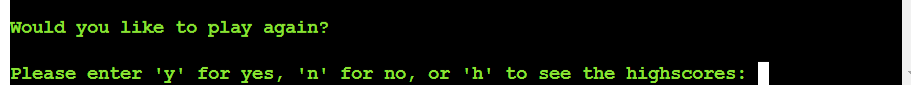

### Future Implementations

- Whole Word Guess: 
  - Incorporate a feature that allows players to guess the entire hidden word at once. This addition will provide an alternative gameplay strategy and enhance the player experience.
- Difficulty Levels: 
  - Implement difficulty levels that adjust the maximum number of attempts based on the selected difficulty.

[Back to Contents](#contents)

---

## Technologies Used

### Languages Used

The primary language employed in this project is [Python](https://www.python.org/). The code for this project can be found [here](https://github.com/IzabellaLopes/medical-hangman/blob/main/run.py).

### Frameworks, Libraries & Programs Used

- [VS Code](https://code.visualstudio.com/) - IDE used to create the Medical Hangman game.

- [Lucidchart](https://www.lucidchart.com/) - Used to create flowcharts.

- [Github](https://github.com/) - Used for file storage, version control, and hosting page assets.

- [Code Institute Python Essentials Template](https://github.com/Code-Institute-Org/python-essentials-template) - Served as the foundational structure for this project.

- [Google Sheets](https://www.google.co.uk/sheets/about/) - Data source for words and player highscores.

- [Code Institute Python Linter](https://pep8ci.herokuapp.com/) - Verify code conformity with PEP8.

- [Pylance Validator](https://marketplace.visualstudio.com/items?itemName=ms-python.vscode-pylance)
  
- [Heroku](https://www.heroku.com/) - Used to deploy the project.

- [TinyPNG](https://tinypng.com/) - To compress images

- [CloudConvert](https://cloudconvert.com/) - To transform a video into a GIF for inclusion in the Readme.md file.

- [Favicon.io](https://favicon.io/) - To create favicon.

- [Chat-GPT](https://chat.openai.com/) - Enhance Readme.md readability; streamline content for effective communication.
    
### Modules Imported

- [os](https://docs.python.org/3/library/os.html) - Provides functions for interacting with the operating system. Used for its `clear` tool, to clear the terminal window.
  
- [time](https://docs.python.org/3/library/time.html) - Offers functions to work with time-related tasks. Used to calculate the time taken to complete the game.
  
- [math](https://docs.python.org/3/library/math.html) - Allows mathematical operations and functions to be used in the code. Used for floor and ceiling rounding of variables.
  
- [gspread](https://docs.gspread.org/en/v5.10.0/) - Enables interaction with Google Sheets for spreadsheet operations.
  
- [google.oauth2.service_account.Credentials](https://google-auth.readthedocs.io/en/master/reference/google.oauth2.service_account.html) - Provides authentication credentials for Google services.
  
- [random](https://docs.python.org/3/library/random.html) - Used to randomly select the word for the game.
  
- [colorama.init, Fore, Style](https://pypi.org/project/colorama/) - Enhances console output with colored text and styles.
  
- [ascii_img](https://patorjk.com/software/taag/#p=display&f=Stick%20Letters&t=WELCOME%20TO%0AMEDICAL%20HANGMAN!): Used to create ASCII art.

[Back to Contents](#contents)

---

## Testing

Please refer to [TESTING.md](TESTING.md) file for a comprehensive overview of all conducted testing procedures.

### Bugs

| **BUG** | **DESCRIBE THE BUG**  | **HOW I SOLVED**|
| ------- | ------- | ------- |
| Incorrect interpretation of spaces between words | The bug involved an incorrect interpretation of spaces between words in the create_hidden_word function, resulting in an unbroken string of underscores | The bug was resolved by adopting a new approach in the create_hidden_word function. This revised method utilizes the join function and a list comprehension to individually process each character of the word. This approach accurately manages spaces between words. When a character is not a space, an underscore is inserted; when a character is a space, it remains unchanged as a space. Consequently, this updated strategy ensures accurate handling of spaces between words, enabling the proper separation of words with spaces or representation by underscores as required |
| Terminal Display Accumulates Blank Lines with Overlapping of the First Row of ASCII Art Illustrations When Switching Screens | When transitioning between different screens in the Python hangman game, an unintended behavior occurred where a new blank line was being added with each screen change. This led to the accumulation of empty lines over time, causing an increase in the terminal's size. | To address this issue, the problem was resolved by replacing the previous method clear_terminal() with the command `os.system('cls' if os.name == 'nt' else "printf '\033c'"). This change prevented the accumulation of blank lines and ensured efficient clearing of the terminal screen during screen transitions. Additionally, the formatting of the ASCII art illustrations at the beginning of the screens was reconfigured to avoid any overlap or misalignment. These adjustments collectively ensured a seamless and visually pleasing experience during gameplay by maintaining a clean terminal display and eliminating unnecessary blank lines. |

[Back to Contents](#contents)

---

## Deployment 

The website has been successfully deployed on Heroku. You can access the live site [here](https://medical-hangman-9035ef835c7a.herokuapp.com/).

### Code Institute Python Essentials Template 

To create a terminal-based user interface using the Code Institute Python Essentials Template and display Python code output:

1. Go to the [Code Institute Essentials Template](https://github.com/Code-Institute-Org/python-essentials-template) and click on "Use this template."
2. Choose "Create a new repository."

### Deployment process

1. GitHub Setup
   - Log in to [Github](https://github.com/).
   - Access the repository for deployment. The repository for the website can be found [here](https://github.com/IzabellaLopes/medical-hangman).

2. Heroku Setup
   - Log in to [Heroku](https://www.heroku.com/). 
   - Click the "New" button in the top right corner.
   - Select "Create New App."
   - Provide a name for the app (medical-hangman) and choose a region (Europe).
   - Click the "Create app" button.
   - Navigate to the "Deploy" section in the navigation bar. Under "Deployment Method," choose GitHub/Connect to GitHub.
   - In the "Connect to GitHub" section, enter the repository name (medical-hangman) and click the search button.
   - Once the repository link appears in the search results, click the "Connect" button.
    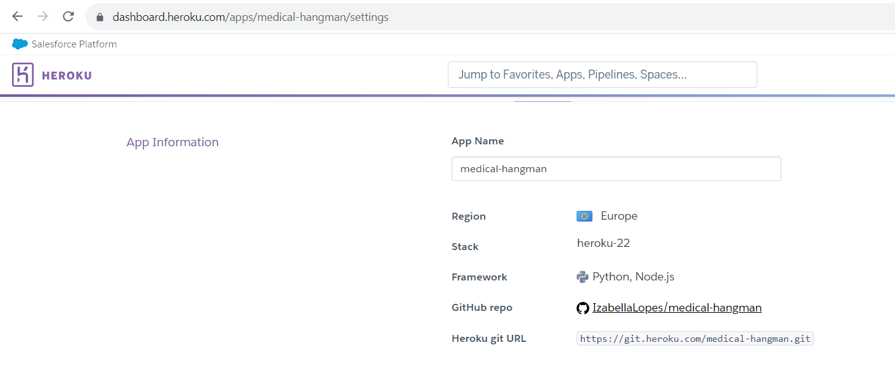

  
3. Google Sheets and Credentials Setup
   - Duplicate the Google Sheet for this game by going to File > Make a copy [here](https://docs.google.com/spreadsheets/d/1a13xeQ8T7SavpKMjG5aR-Er4OXXsyd4ns8axhWKPYYA/edit?usp=sharing).
   - Create a new project on the [Google Could Platform](https://console.cloud.google.com/projectcreate).
   - Activate the [Google Drive API](https://console.cloud.google.com/apis/library/drive.googleapis.com).
   - Generate credentials for accessing **Application Data** [here](https://console.cloud.google.com/apis/credentials/wizard?api=drive.googleapis.com).
   - Grant permissions of **Basic > Editor**.
   - Create new service account keys (type: JSON).
   - Copy the email address from the **Service Accounts** section and add it as an **Editor** to your duplicated copy of the Google Sheet.
   - Enable the [Google Sheets API](https://console.cloud.google.com/apis/library/sheets.googleapis.com).
  
4. Heroku Configuration Variables (Config Vars)
   - Download your key file and return to your [Heroku Dashboard](https://dashboard.heroku.com/apps) to select your app.
   - Under Settings, find **Config Vars** and add the following:
  
  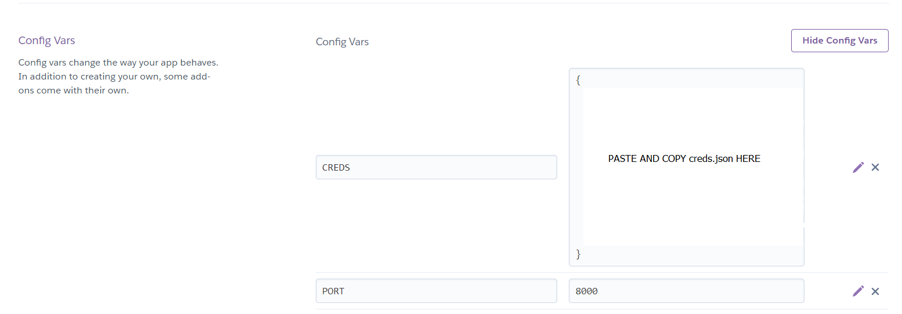

5. Buildpacks and Deployment
   - Go to Settings in the nav bar and select "Add Buildpacks."
   - Add `Python` and save. Then add `Node.js`, ensuring that Python is listed first.
  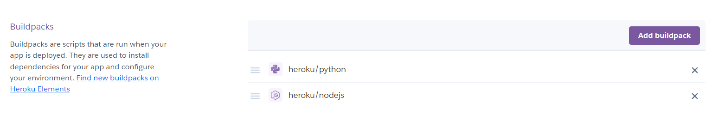

   - Once the Config Vars are set, click Deploy. 
   - Choose either Manual or Automatic deployment. Automatic deployment updates the site automatically with your GitHub commits. Ensure that "Branch to deploy" is set to the main branch.
   - Finally, click the "Deploy" button to make the website go live.

### Local Development

#### How to Fork

To fork the repository:

1. Login (or signup) to GitHub account.
2. Go to the repository for this project, [IzabellaLopes/medical-hangman](https://github.com/IzabellaLopes/medical-hangman).
3. Click the Fork button in the top right corner.
4. Edit the repository name and description if desired
4. Click the green create fork button

#### How to Clone

To clone the repository:

1. Login (or signup) to GitHub account.
2. Go to the repository for this project, [IzabellaLopes/medical-hangman](https://github.com/IzabellaLopes/medical-hangman).
3. Click on the code button, select whether you would like to clone with HTTPS, SSH or GitHub CLI and copy the link shown.
4. Open the terminal in your code editor and change the current working directory to the location you want to use for the cloned directory.
5. Type 'git clone' into the terminal and then paste the link you copied in step 3. Press enter.

## Credits

### Code

- [Code Institute Essentials Template](https://github.com/Code-Institute-Org/python-essentials-template) - This template marked the initial phase of commencing my third portfolio project for Code Institute, employing essential Python skills.
- [README.md examples from kera-cudmore](https://github.com/kera-cudmore/readme-examples/tree/main) - I want to convey my appreciation to Kera Cudmore for providing the foundational structure of a README file.

### Content

- Content for the website was written by Izabella Lopes.
- [P3-Hangman-Python-Terminal-Game from Paul Young](https://github.com/paulio11/P3-Hangman-Python-Terminal-Game) - When I was preparing to begin my medical-themed Hangman game, I had a strong desire to utilize the Google Sheets API to enhance my understanding of Python concepts. I want to express my sincere gratitude to Paul Young, the developer behind the code, as their work served as a valuable guide for my project, particularly in relation to implementing Google Sheets integration and managing highscores.
- [Clear terminal in Python](https://stackoverflow.com/questions/2084508/clear-terminal-in-python) - This website assisted me in efficiently clearing the interpreter console.

### Media

- I individually crafted the images for this Python essentials project using an ASCII art generator called [patorjk.com](https://patorjk.com/software/taag/#p=display&f=Stick%20Letters&t=WELCOME%20TO%0AMEDICAL%20HANGMAN!), which is detailed in the imagery section.

## Acknowledgments

I would like to express my gratitude to the following individuals who played significant roles in the successful completion of my third project:

- I am grateful to my family for their consistent support and understanding throughout this period of intense studying.
- I want to express my sincere thanks to my fellow peers from the April 2023 cohort at Code Institute. Their invaluable contributions in bug testing are deeply appreciated.
- Jubril Akolade, my mentor from the Code Institute.