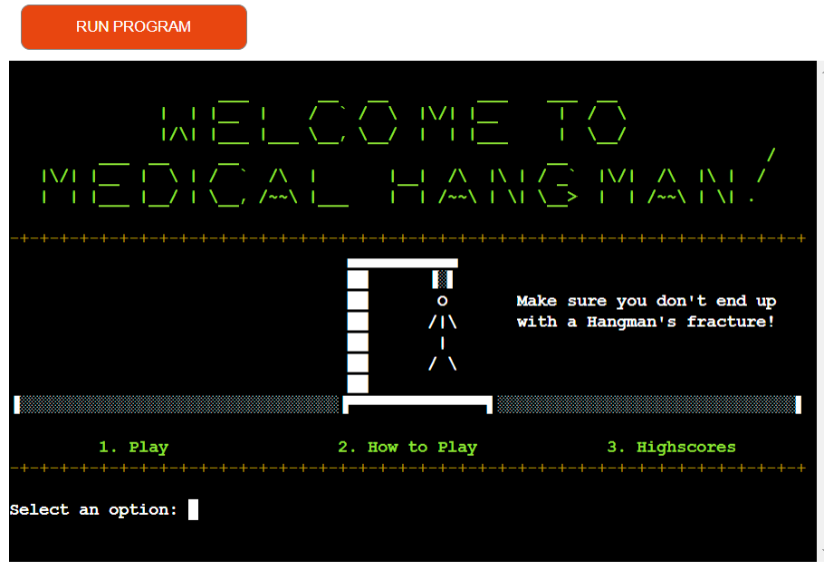
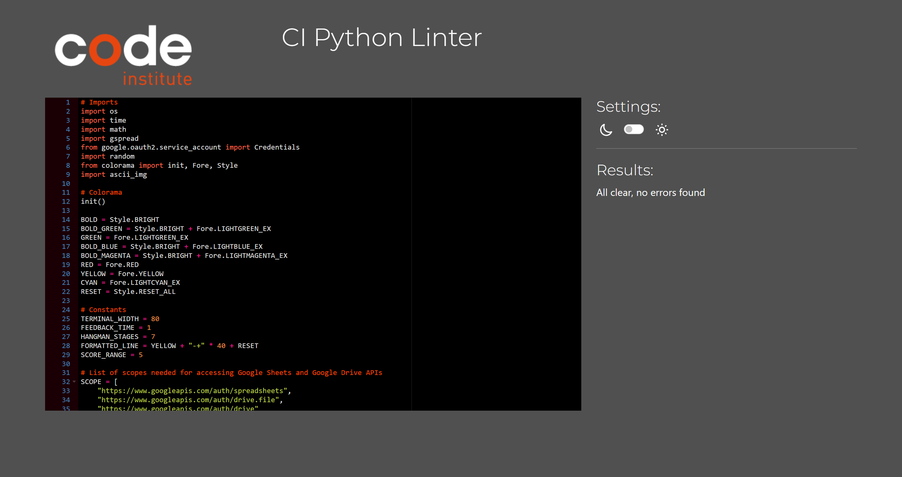
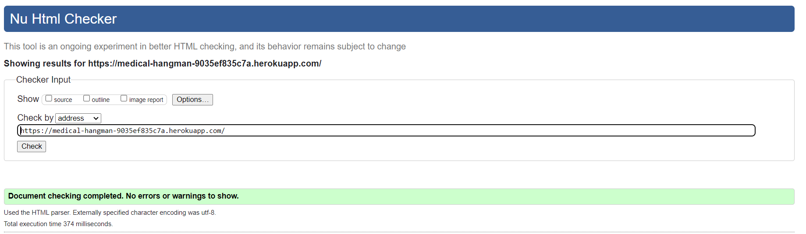
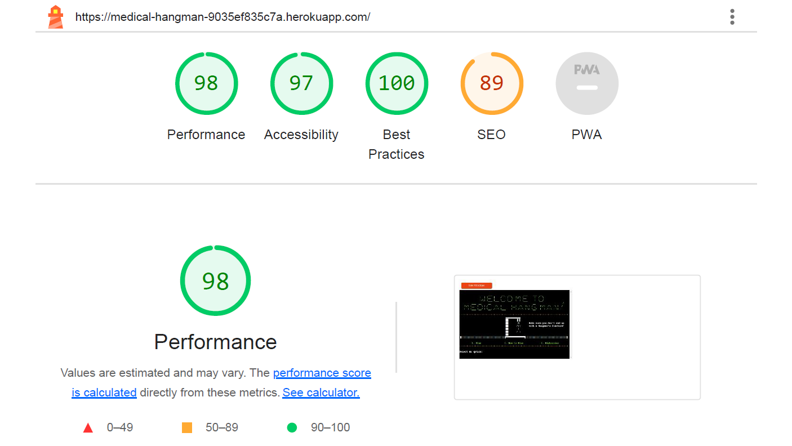

# Medical Hangman

[Medical Hangman Live Page](https://medical-hangman-9035ef835c7a.herokuapp.com/)

---

## CONTENTS

- [Medical Hangman](#medical-hangman)
  - [CONTENTS](#contents)
  - [AUTOMATED TESTING](#automated-testing)
    - [CI Python Linter](#ci-python-linter)
    - [W3C Validator](#w3c-validator)
    - [Lighthouse](#lighthouse)
  - [MANUAL TESTING](#manual-testing)
    - [Testing User Stories](#testing-user-stories)

To ensure the accuracy, readability, and adherence to coding standards of the Medical Hangman Game, a rigorous validation process was conducted. By integrating the CI Python Linter into the development pipeline, I automated the assessment of my code for syntax errors, style inconsistencies, and other potential problems. This proactive approach aimed to identify and address issues early in development, minimizing the risk of bugs reaching the final product.

---

## AUTOMATED TESTING

### CI Python Linter

The Medical Hangman game has been thoroughly tested using the CI Python Linter, and the results indicate that the code is error-free and meets the required coding standards. The testing process included analyzing both the run.py and ascii_img.py files for any potential issues.

- **run.py**

- **ascii_img.py**

### W3C Validator

The validation for layout.html shows no errors when passing through the official [W3C validator](https://validator.w3.org/).

- **W3C Validator**

### Lighthouse

I utilized Lighthouse, a tool available in the Chrome Developer Tools, to assess the performance, accessibility, best practices, and SEO aspects of the website.

- **Lighthouse**

---

## MANUAL TESTING

### Testing User Stories

`First Time Visitors`

| Goals                                                                                                                                                        | How are they achieved?                                                                                                                                                                                                             |
| :----------------------------------------------------------------------------------------------------------------------------------------------------------- | :--------------------------------------------------------------------------------------------------------------------------------------------------------------------------------------------------------------------------------- |
| To gain a clear understanding of how the game is played and its connection to medical terminology. | Navigate to the "How to Play" section to receive step-by-step instructions on playing the Medical Hangman Game. You'll find a detailed breakdown of gameplay mechanics, such as choosing categories, making guesses, and progressing through the game. |
| The opportunity to explore and select from various available categories that align with your interests. | When you begin, you'll be prompted to select a category that intrigues you the most. The game provides options like "BONE," "ORGAN," "DISEASE OR CONDITION," and "RADIOLOGY." This variety ensures a tailored experience that aligns with your medical interests.|
| An engaging and interactive interface that guides you through the gameplay process. | The game boasts an intuitive and interactive interface, designed to lead you through each exciting round. The interface incorporates ASCII art and visual elements to enhance the experience and make the gameplay both informative and entertaining.|

`Returning Visitors`

| Goals                                                                                                                                                        | How are they achieved?                                                                                                                                                                                                             |
| :----------------------------------------------------------------------------------------------------------------------------------------------------------- | :--------------------------------------------------------------------------------------------------------------------------------------------------------------------------------------------------------------------------------- |
| Challenge Yourself: Engage in new game rounds to enhance scores across medical term categories. | Challenge: Select varied categories to test skills and adapt guessing strategies. |
| Enjoy and Learn: Continue enjoying game entertainment while reinforcing medical vocabulary. | Enjoyment: Immersive gameplay with engaging visuals enriches medical vocabulary.|
| Compare and Compete: Look forward to comparing high scores with past achievements and other players. | Comparison: Track high scores, measure progress, and compete for leaderboard supremacy.|
