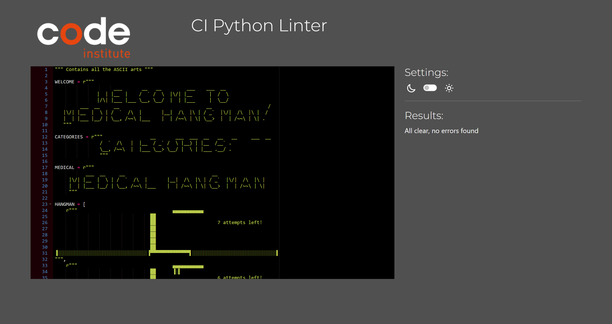

# Medical Hangman

[Medical Hangman Live Page](https://medical-hangman-9035ef835c7a.herokuapp.com/)

---

## CONTENTS

- [Medical Hangman](#medical-hangman)
  - [CONTENTS](#contents)
  - [AUTOMATED TESTING](#automated-testing)
    - [CI Python Linter](#ci-python-linter)

To ensure the accuracy, readability, and adherence to coding standards of the Medical Hangman Game, a rigorous validation process was conducted. By integrating the CI Python Linter into the development pipeline, I automated the assessment of my code for syntax errors, style inconsistencies, and other potential problems. This proactive approach aimed to identify and address issues early in development, minimizing the risk of bugs reaching the final product.

---

## AUTOMATED TESTING

### CI Python Linter

The Medical Hangman game has been thoroughly tested using the CI Python Linter, and the results indicate that the code is error-free and meets the required coding standards. The testing process included analyzing both the run.py and ascii_img.py files for any potential issues.

- **run.py**

- **ascii_img.py**

